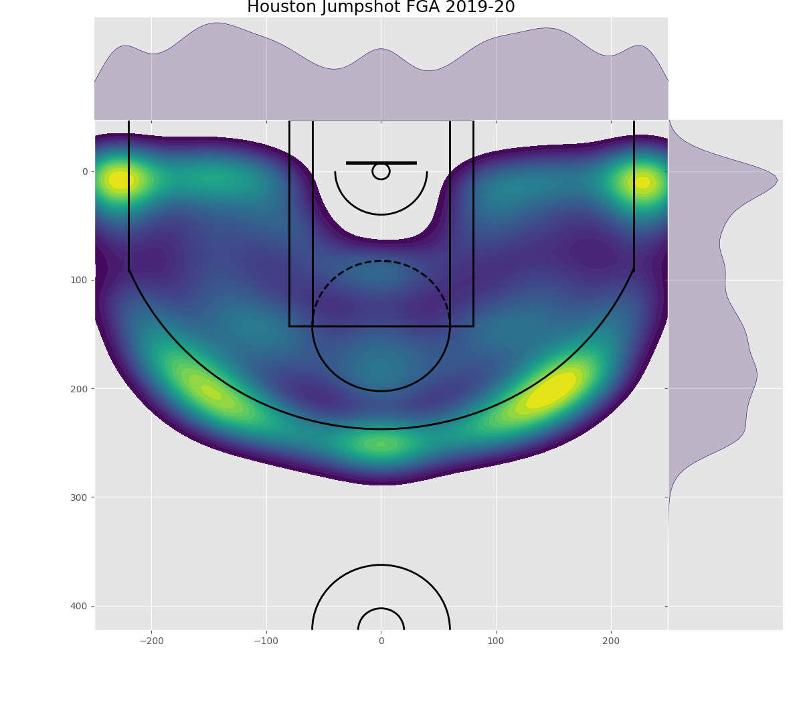

# NBA_Midrange_Usage
*Is the mid-range shot really dead?* 

In my post last week, I covered the Rockets offense, prioritizing spacing, skill over size, and particular shot selection: layups, free throws, and threes. One of the responses (shoutout to Gil Pasternak) elaborated on the unique success of the Rockets offense in spite of their little movement. Since the rise of the splash brothers and the onslaught of threes of the early 2010s Golden State Warriors (and really since early 2000s), three point shooting has been on the rise and the use of the mid-range game has faded away :). Stars no longer abuse the iconic classic fadeaway of MJ and Kobe but rather the deep-ball. So, is the mid-range shot dead?

[*Here's the an article that tries to visualize the rapid decline of the mid-range shot.*](https://flowingdata.com/2019/01/15/goodbye-mid-range-shot/)

This year, the Rockets posted an above average offensive rating while taking just over 5 mid-range attempts per game (almost entirely Westbrook). But, surprisingly, the team that posted to most mid-range attempts (by far), the San Antonio Spurs, finished the season with a nearly identical rating.

Regardless, the mid-range shot is nowhere near as prevalent as it once was. This season's league high of 21.9 attempts is still [below the league *low* of the 1999-2000 season](https://www.nba.com/stats/teams/shooting/?Season=2019-20&SeasonType=Regular%20Season&DistanceRange=By%20Zone&sort=Mid-Range%20FGA&dir=1). Even the "old-fashioned" Spurs heavily utilize corner-threes and attack the basket like most modern teams. 

Since we just recently covered data visualization, I tried to present the Rockets and Spurs shot charts for this last season. Despite employing opposite offensive playstyles, the heatmaps show that these teams are still quite similar.

Sorry for posting so late in the week! :)
